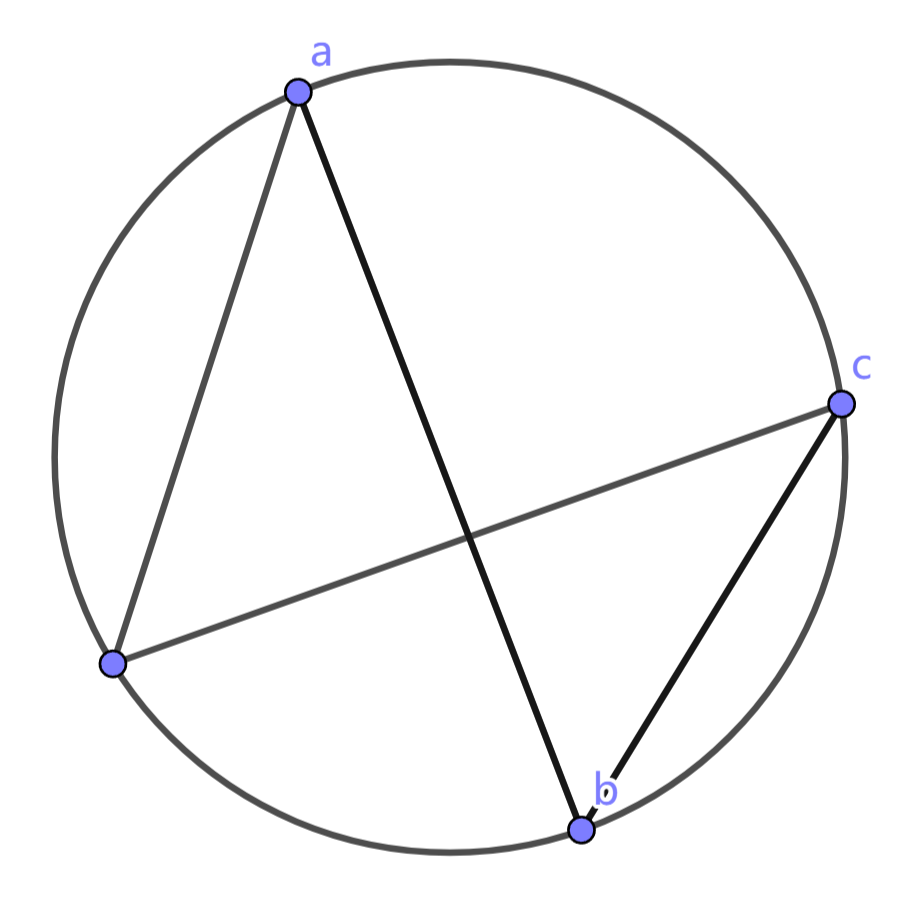

# 数学公式

## 方差、标准差和均方差

### 方差

方差衡量的是数据与均值的偏离程度。
$$
S^2 = \frac{1}{n-1} \sum_{i=1}^{n} (x_i - \overline{x})^2
$$
$x_i$ 是第 $i$ 个数据点，$\overline{x}$ 是样本均值（即$\overline{x} = \frac{1}{n} \sum_{i=1}^{n} x_i$），$n$ 是样本数量。

### 标准差

标准差是方差的平方根，用来衡量数据的离散程度。
$$
S = \sqrt{\frac{1}{n-1} \sum_{i=1}^{n} (x_i - \overline{x})^2}
$$
$x_i$ 是第$i$ 个数据，$\overline{x} $ 是样本平均值，$n$是样本总数。

### 均方差

均方差通常用于衡量估计值与真实值之间的差异，尤其在回归分析和机器学习中非常常见。
$$
\text{MSE} = \frac{1}{n} \sum_{i=1}^{n} (y_i - \hat{y}_i)^2
$$
$y_i$ 是真实值，$\hat{y_i}$ 是预测值或估计值，$n$ 是样本数量。

$$
\tan(x) = x + \frac{1}{3}x^3 + \frac{2}{15}x^5 + \frac{17}{315}x^7 + \cdots \\
\tan(x) = \sum_{n=0}^{\infty} a_n x^{2n+1}
$$

## 克莱姆法则

假定有以下方程组：
$$
\left\{\begin{matrix} 
a_1x + b_1y = c_1 \\
a_2x + b_2y = c_2
\end{matrix}\right.
$$
则根据克莱姆法则，可以快速的到解：
$$
\Delta = 
\begin{vmatrix}  
a_1 & b_1 \\
a_2 & b_2 
\end{vmatrix},
x_1 = \frac{1}{\Delta}\begin{vmatrix}  
c_1 & b_1 \\
c_2 & b_2 
\end{vmatrix},
x_2 = \frac{1}{\Delta}\begin{vmatrix}  
a_1 & c_1 \\
a_2 & c_2 
\end{vmatrix},
$$
因此该方程的解为：
$$
x_1 = \frac{c_1b_2 - c_2b_1}{a_1b_2 - a_2b_1}, x_2 = \frac{a_1c_2 - a_2c_1}{a_1b_2 - a_2b_1}
$$

## 棣莫弗公式

$$
\text{由} z = |z|(\cos \text{Arg} z + i \sin \text{Arg} z), \text{得到} (\cos \theta + \sin \theta)^n = \cos (n\theta) + i \sin(n\theta)
$$

例如，求$(1 + i)^n (n = 1, 2, \cdots)$的实部和虚部。

证：
$$
\text{由} 1 + i = \sqrt{2}(\cos \frac{\pi}{4} + i \sin \frac{\pi}{4}), \text{有}(1 + i)^n = (\sqrt{2})^n (\cos \frac{n\pi}{4} + i \sin \frac{n\pi}{4})
$$
于是
$$
\text{Re}[(1+i)^n] = (\sqrt{2})^n \cos \frac{n\pi}{4}, \text{Im}[(1+i)^n] = (\sqrt{2})^n\sin \frac{n\pi}{4}
$$

## 线性同余法

利用率计算：$f(x) = 0.94^{x}$

生成(0, 1)区间小数：$g(x) = \frac{Math.random(0, 2^{31}-1)} { 2^{31}-1}$

概率比较：$f(x) <= g(x)$

## 三角公式

正弦加法公式
$$
\sin(\theta + \phi) = \sin \theta \cdot \cos \phi + \cos \theta \cdot \sin \phi
$$

余弦加法公式
$$
\cos(\theta + \phi) = \cos \theta \cdot \cos \phi - \sin \theta \cdot \sin \phi
$$

# 数学定义

## 符号定义

$\mathbb{R}^2$ 复平面	$\mathbb{C}$ 复数集合

## 封闭性

在某种运算下，如果两个元素属于某个集合，那么它们运算的结果仍然属于该集合。换句话说，集合对该运算是“封闭”的，意味着该集合内的元素进行运算后，结果依然属于这个集合。

## 数学符号

**希腊字母**

|    小写    |    大写    |
| :--------: | :--------: |
|  $\alpha$  |  $\Alpha$  |
|  $\beta$   |  $\Beta$   |
|  $\gamma$  |  $\Gamma$  |
|  $\delta$  |  $\Delta$  |
| $\epsilon$ | $\Epsilon$ |
|  $\zeta$   |  $\Zeta$   |
|   $\eta$   |   $\Eta$   |
|  $\theta$  |  $\Theta$  |
|  $\iota$   |  $\Iota$   |
|  $\kappa$  |  $\Kappa$  |
| $\lambda$  | $\Lambda$  |
|   $\mu$    |   $\Mu$    |
|   $\nu$    |   $\Nu$    |
|   $\xi$    |   $\Xi$    |
|    $o$     |    $O$     |
|   $\pi$    |   $\Pi$    |
|   $\rho$   |   $\Rho$   |
|  $\sigma$  |  $\Sigma$  |
|   $\tau$   |   $\Tau$   |
| $\upsilon$ | $\Upsilon$ |
|   $\phi$   |   $\Phi$   |
|   $\chi$   |   $\Chi$   |
|   $\psi$   |   $\Psi$   |
|  $\omega$  |  $\Omega$  |

**花体字母**

$\mathbb{A}$$\mathbb{B}$$\mathbb{C}$$\mathbb{D}$

$\mathcal{A}$$\mathcal{B}$$\mathcal{C}$$\mathcal{D}$

$\mathscr{A}$$\mathscr{B}$$\mathscr{C}$$\mathscr{D}$

$\mathrm{A}$$\mathrm{B}$$\mathrm{C}$$\mathrm{D}$

$\mathbf{A}$$\mathbf{B}$$\mathbf{C}$$\mathbf{D}$

$\mathit{A}$$\mathit{B}$$\mathit{C}$$\mathit{D}$

$\mathsf{A}$$\mathsf{B}$$\mathsf{C}$$\mathsf{D}$

$\mathtt{A}$$\mathtt{B}$$\mathtt{C}$$\mathtt{D}$

$\mathfrak{A}$$\mathfrak{B}$$\mathfrak{C}$$\mathfrak{D}$

# 复数

## 第一章 复数及复平面

### 第一节 复数及几何表示

复数 $z = x + iy$ $\Leftrightarrow$ $\mathbb{R}^2$上的点$P(x, y)$ $\Leftrightarrow$ $\mathbb{R}^2$上的向量$\vec{OP}$

复数的**模**：$|\vec{OP}| = \sqrt{x^2 + y^2}$ 

复数的**幅角**：$\text{Arg z} = \theta + 2k\pi$，$Ox$ 轴到 $\vec{OP}$ 沿逆时针方向所形成的角，只有当$z \neq 0$ 幅角才有意义。

幅角的**主值**：$0 \leq \text{arg z} \lt 2\pi$ 或 $-\pi \lt \text{arg z} \leq \pi$，幅角和主值的关系为 $\text{Arg z} = \text{arg z} + 2k\pi$

复数 $z = x + iy$ 的**三角表示**：$z = |z|(cos \text{Arg z} + sin \text{Arg z})$

复数 $z = x + iy$ 的**共轭**：$\overline{z} = x - iy$

**性质1**：$|z| = |\overline{z}|$，$z \cdot \overline{z} = |z|^2$， $x = \frac{1}{2}(z + \overline{z})$， $y = \frac{1}{2i}(z - \overline{z})$

**性质2**：$|Re \; z| \leq |z|$， $|Im \; z| \leq |z|$， $|z| = \sqrt{z \cdot \overline{z}}$

**三角不等式**：$||z_1| - |z_2|| \leq |z_1 \pm z_2| \leq |z_1| + |z_2|$

复数 $z = x + iy$ 的**倒数**： $\frac{1}{z} = \frac{x}{x^2+y^2} + i\frac{y}{x^2+y^2}$

例1：试用复数表示圆的方程
$$
a(x^2 + y^2) + bx + cy + d = 0 (a \neq 0)
$$
其中$a, b, c, d$为实数。

【解】记 $z = x + iy$, 则 $x = \frac{1}{2}(z + \overline{z})$, $y = \frac{1}{2i}(z - \overline{z})$, $x^2 + y^2 = z \cdot \overline{z}$，代入直角坐标方程得
$$
az\overline{z} + b\frac{1}{2}(z+\overline{z})+c\frac{1}{2i}(z-\overline{z})+d = 0
$$
整理得
$$
az\overline{z} + \frac{1}{2}(b - ic)z + \frac{1}{2}(b + ic)\overline{z}+d = 0
$$
记 $\beta = \frac{1}{2}(b + ic)$，则原方程可化为
$$
az\overline{z} + \overline{\beta}z + \beta\overline{z} + d = 0
$$
该方程称为**圆方程的复数形式**。

例2：设$z_1$和$z_2$是两个复数，证明：
$$
|z_1 + z_2|^2 = |z_1|^2 + |z_2|^2 + 2\text{Re}(z_1\overline{z}_2)
$$
并由此证明三角不等式。

【解】由复数的运算性质有
$$
\begin{align*}
|z_1 + z_2|^2 
&= (z_1 + z_2) \cdot \overline{(z_1 + z_2)} = (z_1 + z_2) \cdot (\overline{z}_1 + \overline{z}_2) \\
&= z_1\overline{z}_1 + z_1\overline{z}_2 + \overline{z}_1z_2 + z_2\overline{z}_2 \\
&= |z_1|^2 + |z_2|^2 + 2\text{Re}(z_1\overline{z}_2)
\end{align*}
$$
根据 $\text{Re}(z_1\overline{z}_2) \leq |z_1||z_2|$，由上述等式有
$$
|z_1 + z_2|^2 \leq |z_1|^2 + |z_2|^2 + 2|z_1||z_2| = (|z_1| + |z_2|)^2
$$
两边同时开平方，所以有 $|z_1 + z_2| \leq |z_1| + |z_2|$.同理可得$||z_1| - |z_2|| \leq |z_1 \pm z_2|$.

*PS: 根据任何一个复数的实部大于等于它的模再反号的性质，推导出$2\text{Re}(z_1\overline{z}_2) \geq -2|z_1||z_2|$*

例3：写出过复平面 $\mathbb{C}$ 上不同两点 $a, b$ 的直线及过不共线三点 $a, b, c$ 的圆的表达式.

【解】（1）直线情形：

若 $z$ 在 $a, b$ 之间，则 $z - a$ 与 $z - b$ 方向相反，因此 $\frac{z - a}{z - b}$ 的幅角主值为 $-\pi$，通过复数的性质知道复数的幅角主值如果是 $\pi$ 或 $-\pi$，那么它的虚部为 $0$.因此有
$$
\text{Im}\frac{z - a}{z - b} = 0
$$
若 $z$ 在 $a, b$ 之外，则 $z - a$ 与 $z - b$ 方向相同，由此 $\frac{z-a}{z-b}$ 的幅角主值为 $0$，因此同样有
$$
\text{Im}\frac{z - a}{z - b} = 0
$$
（2）圆情形

如图所示

### 第二节 复平面的拓扑

邻域：${U}(\alpha, r) \triangleq \{ z | z \in \mathbb{C}, | z - \alpha | \lt r \}$，开圆盘

去心邻域：$\mathring{U} \triangleq \{ z | z \in \mathbb{C}, 0 \lt | z - \alpha | \lt r \}$

闭邻域：$\overline{U}(\alpha, r) \triangleq \{ z | z \in \mathbb{C}, | z - \alpha | \le r \}$，闭圆盘

\> 复平面$\mathbb{C}$上的分类：设$\alpha \in \mathbb{C}$，点集$E \subset \mathbb{C}$

称$\alpha$为$E$的**聚点**：$\forall r \gt 0$，均有$\mathring{U}(\alpha, r) \cap E \ne \emptyset$

称$\alpha$为$E$的**内点**：$\exists r \gt 0$，使得${U}(\alpha, r) \subset E$

称$\alpha$为$E$的**边界点**：$\forall r \gt 0$，有${U}(\alpha, r) \cap E \ne \emptyset, {U}(\alpha, r) \cap E^{\complement} \ne \emptyset$，$E$的边界点的全体记为$\partial E$，$E$的闭包为$\overline{E} = E \cup \partial E$

> $E^{\complement}$是$E$的余集，即$E^{\complement} = \mathbb{C} \setminus E$

\> 复平面集合$E \subset \mathbb{C}$的分类：

称$E$为开集：若$E$的所有点均为其内点；

称$E$为闭集：若$E^{\complement} = \mathbb{C} \setminus E$为开集；

称$E$为有界集：若$\exists {U}(\alpha, r)$使${U} \subset {U}(\alpha, r)$；

称$E$为紧集：若$E$为有界闭集.

## 第二章 解析函数

### 第一节 解析函数

#### 第一小节 极限与连续

**定义** 设$E$为复平面$\mathbb{C}$上的点集，若存在法则$f$，使得$\forall z = x + iy \in E$，$\exists w = u + iv \in \mathbb{C}$和它对应，则称$f$为在$E$上确定的**复变数函数**，简称**复变函数**. 记为
$$
w = f(z), z \in E \quad \text{或} \quad f:E \to \mathbb{C}, z \mapsto f(z).
$$

> 在实函数的定义$y = f(x)$中，每个$x$都有唯一的$y$与之对应；在复变函数中并没有唯一限制，只要求存在与之对应的值。
> $$
> 复变函数 \left\{
> \begin{array}{ll}
> 单值复变函数，例如 w = z^2，w = \frac{z + 1}{z - 1}. \\
> 多值复变函数，例如 w = Arg \; z，w = \sqrt{z}.\\
> \end{array}
> \right.
> $$

**定义** 函数$w = f(z)$定义在集合$E$上，$z_0$为聚点，$\alpha$为复常数，若$\forall \epsilon > 0,\exists \delta = \delta(\epsilon) > 0$，使得当$z \in E$且$0 \lt |z - z_0| \lt \delta$时，成立
$$
|f(z) - \alpha| \lt \epsilon
$$
则称$z$在$E$中趋于$z_0$时，$f(z)$趋于极限$\alpha$. 记为
$$
\lim_{z \to z_0, z \in E}{f(z)} = \alpha \quad 或 \quad f(z) \to \alpha \; (z \to z_0, z \in E)
$$

> 极限定义的几何解释：假设$E$是$z$ - 平面上的一个点集，$f$是$z$ - 平面到$w$-平面之间的一个映射。$z_0$是$z$ - 平面上的一个点，它可能在$E$中，也可能不在$E$中，但它一定是$E$的一个聚点。$\alpha$是$w$ - 平面上的一个点，当$z$趋于$z_0$时，$f(z)$趋于$\alpha$。
>
> 定义的解释：在$w$ - 平面中，任给一个以$\alpha$为圆心以$\epsilon$为半径的圆，一定可以找到一个以$z_0$为圆心$\delta$为半径的去心邻域，对于去心邻域中的任意一点$z$通过$w = f(z)$的映射，一定可以变成以$\alpha$为圆心以$\epsilon$为半径圆盘中的某一点。

定义 

### 第二节 初等函数
